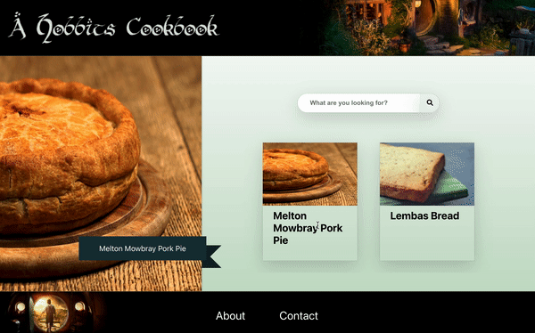

<!-- PROJECT LOGO -->
 

  

<h3 align="center">A Hobbit's Cookbook</h3>

“Faërie contains many things besides elves and fays, and besides dwarfs, 
  witches, trolls, giants, or dragons; it holds the seas, the sun, the
  moon, the sky; and the earth, and all things that are in it: tree and 
  bird, water and stone, wine and bread, and ourselves, mortal men, when 
  we are enchanted.”
  
― J.R.R. Tolkien, Tolkien On Fairy-stories

  

     
    <a href="https://github.com/coltskeen/A-hobbits-cookbook/issues">Report Bug</a>
    ·
    <a href="https://github.com/coltskeen/A-hobbits-cookbook/issues">Request Feature</a>
  

<!-- TABLE OF CONTENTS -->

  
Table of Contents

  <ol>
    <li>
      <a href="#about-the-project">About The Project</a>
      <ul>
        <li><a href="#built-with">Built With</a></li>
      </ul>
    </li>
    <li><a href="#roadmap">Roadmap</a></li>
    <li><a href="#contact">Contact</a></li>
  </ol>

<!-- ABOUT THE PROJECT -->
## About The Project

Ever find yourself scouring the internet for hours just to craft that perfect - and thoroughly enchanting - Hobbit, Elven, or Dwarven meal? Well scour no more. This web application brings you the greatest Middle Earth recipes from accross the inter-webs, easily searchable to make your magical meal just right.

(<a href="#top">back to top</a>)

### Built With

* [Node.js](https://nodejs.org/en/docs/)
* [React.js](https://reactjs.org/)
* [JavaScript](https://developer.mozilla.org/en-US/docs/Web/JavaScript)
* [PostgreSQL](https://www.postgresql.org/docs/)
* [GIMP](https://www.gimp.org/docs/)

(<a href="#top">back to top</a>)

<!-- ROADMAP -->
## Roadmap

- [ ] Build out database with more recipes
- [ ] Add functionality to display recipe details when clicked
- [ ] Add login feature
- [ ] Add favorites feature
- [ ] Add feature to build a shopping list with selected recipes

(<a href="#top">back to top</a>)

<!-- CONTACT -->
## Contact

Colt Skeen - [LinkedIn](https://www.linkedin.com/in/coltskeen/) - colton.skeen@gmail.com

Project Link: [A Hobbit's Cookbook](https://github.com/coltskeen/A-hobbits-cookbook)

(<a href="#top">back to top</a>)
